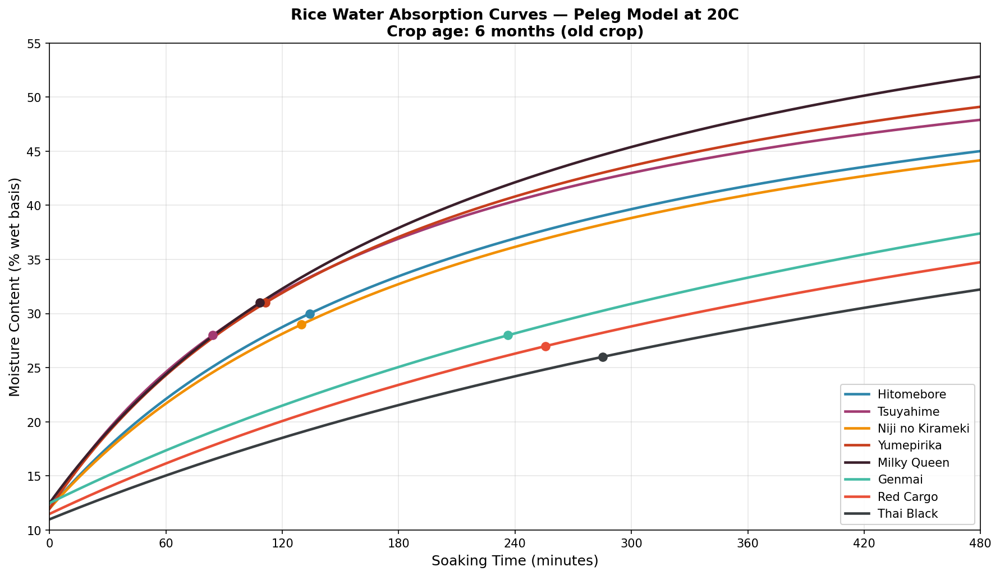
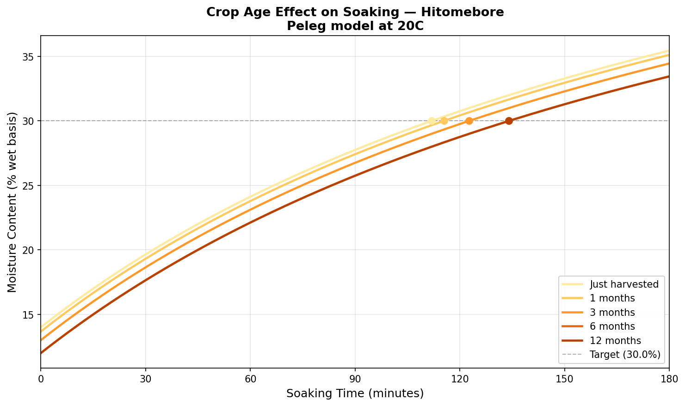
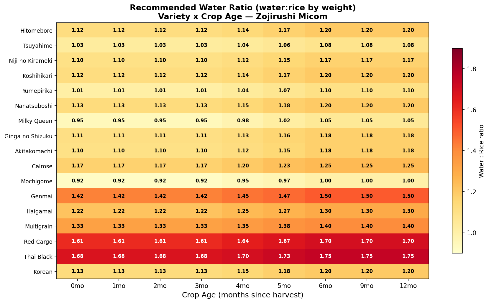
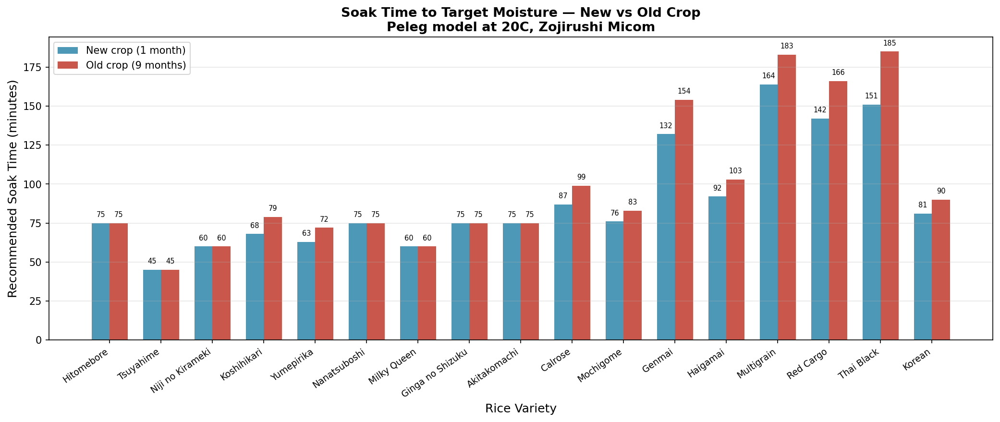

# A Parametric Model for Predicting Soaking Time and Water Ratio Across Rice Cultivars Using the Peleg Equation

**Authors:** Richard Kraaijenhagen

**Status:** Working draft — seeking experimental collaborators

**Repository:** https://github.com/riichard/rice-calculator

---

## Abstract

We present a parametric model for predicting optimal soaking time and cooking water ratio for rice, covering 17 cultivars across four grain types (white japonica, brown, pigmented, and glutinous). The model is built on the Peleg equation for water absorption kinetics, with parameters derived from two measurable grain properties: amylose content and protein content. A cultivar-specific tuning factor captures starch accessibility differences not explained by composition alone. The model accounts for crop age (shinmai vs komai), cooking method (Zojirushi Micom, open pot, pressure cooker, steamer), and pre-soak duration, including a soak-adjusted water ratio that reduces cooking water proportional to moisture already absorbed.

Validated against empirical cooking data for Japanese premium cultivars (Hitomebore, Tsuyahime, Niji no Kirameki) and Thai pigmented rice, the model achieves water ratio predictions within 1.5% of measured values. We also analyze the effect of barometric pressure on rice cooking and find it negligible at sea level (1.3 degrees C boiling point range across typical weather variation in the Netherlands), confirming that variety and crop age are the dominant variables for home cooking optimization.

**Keywords:** rice, Peleg equation, water absorption, soaking kinetics, amylose, japonica cultivars, cooking optimization

---

## 1. Introduction

Rice cooking quality depends on achieving correct hydration and starch gelatinization, both of which are sensitive to variety, grain structure, and preparation method. While experienced cooks develop intuitive ratios for familiar varieties, these are difficult to transfer across cultivars and rarely account for variables like crop age or soaking duration.

The academic literature offers well-validated models for rice hydration kinetics — notably the Peleg equation (Peleg, 1988), which describes moisture uptake as a function of time with only two parameters. Studies have demonstrated that these parameters correlate with measurable grain properties: protein content affects initial absorption rate (Bao et al., 2021), and amylose content affects total absorption capacity (Bao et al., 2021). However, published Peleg parameters cover a limited number of commercially important cultivars and are rarely presented in a form useful for practical cooking decisions.

This paper bridges that gap by:

1. Deriving Peleg parameters parametrically from amylose and protein content, enabling predictions for any characterized variety
2. Calibrating the model against real cooking data from premium Japanese cultivars available in European markets
3. Introducing a soak-adjusted water ratio that accounts for pre-soak hydration
4. Quantifying the (negligible) effect of barometric pressure variation on rice cooking at sea level

### 1.1 Motivation

Japanese rice cultivars exhibit meaningful differences in optimal water ratio despite similar compositions. Tsuyahime requires a water ratio of 1.08 (by weight) while Hitomebore requires 1.20 — a 10% difference between cultivars that share approximately 17% amylose and 6% protein content. This difference, attributed to starch granule accessibility, is well-known among experienced cooks but undocumented in the food science literature as a quantitative parameter.

Similarly, crop age introduces a systematic shift: shinmai (new crop, <3 months post-harvest) requires 5-8% less water than komai (old crop, >6 months), due to higher initial moisture content. These adjustments are part of Japanese culinary tradition but have not been formalized in a predictive model.

---

## 2. Theory and Model

### 2.1 Peleg Equation

The Peleg model (Peleg, 1988) describes moisture absorption during soaking:

```
M(t) = M₀ + t / (k₁ + k₂·t)
```

Where:
- M(t) = moisture content at time t (% wet basis)
- M₀ = initial moisture content (%)
- k₁ = Peleg rate constant (min/%) — governs initial absorption rate
- k₂ = Peleg capacity constant (1/%) — governs equilibrium moisture

The model has been validated for rice with R² ≥ 0.99 across multiple studies (Bao et al., 2021; Allie et al., 2025) and temperatures (25-70 degrees C).

Key derived quantities:
- **Initial absorption rate:** R₀ = 1/k₁ (% per minute)
- **Equilibrium moisture:** M_eq = M₀ + 1/k₂
- **Time to target moisture:** t = k₁·(M_target - M₀) / (1 - k₂·(M_target - M₀))

### 2.2 Parametric Derivation of Peleg Parameters

Rather than fitting k₁ and k₂ per cultivar from experimental soaking data, we derive them from published grain composition using correlations established in the literature:

**Rate constant k₁** — Bao et al. (2021) found a significant negative correlation (P < 0.05) between protein content and water absorption rate. We model this as:

```
k₁ = (0.65 × protein% + 0.8) × G_type × S_access
```

Where G_type is a grain type multiplier (Table 1) accounting for the bran barrier in unmilled rice, and S_access is a cultivar-specific starch accessibility factor.

**Capacity constant k₂** — Bao et al. (2021) found a significant negative correlation (P < 0.05) between apparent amylose content and maximum expansion ratio. We model this as:

```
k₂ = 0.0005 × amylose% + 0.012 + G_offset
```

Where G_offset accounts for reduced absorption capacity in bran-intact grain types (Table 1).

**Table 1. Grain type parameters**

| Grain Type | k₁ multiplier | k₂ offset | Examples |
|-----------|--------------|-----------|----------|
| White (milled) | 1.0 | 0.000 | Hitomebore, Koshihikari |
| Partially milled | 1.3 | -0.002 | Haigamai |
| Brown | 2.0 | -0.004 | Genmai |
| Pigmented | 2.2 | -0.006 | Red cargo, Thai black |

### 2.3 Starch Accessibility Factor

Cultivars with similar amylose and protein content can exhibit different absorption behavior due to starch granule structure, crystallinity, and surface properties. We introduce a dimensionless tuning factor S_access that multiplies k₁:

- S_access < 1.0: grain absorbs faster than composition predicts
- S_access = 1.0: composition-predicted behavior (reference: Hitomebore)
- S_access > 1.0: grain absorbs slower than composition predicts

This factor is calibrated against empirical cooking data. For example, Tsuyahime (S_access = 0.75) has softer outer starch that facilitates water penetration, despite having the same amylose and protein content as Hitomebore (S_access = 1.0).

**Table 2. Starch accessibility factors for characterized cultivars**

| Cultivar | Amylose % | Protein % | S_access | Water Ratio | Rationale |
|----------|----------|----------|----------|-------------|-----------|
| Hitomebore | 17.0 | 6.0 | 1.00 | 1.20 | Reference cultivar |
| Tsuyahime | 17.0 | 6.0 | 0.75 | 1.08 | Softer outer starch, higher absorption |
| Niji no Kirameki | 17.5 | 6.0 | 1.05 | 1.17 | Slightly firmer structure |
| Koshihikari | 17.0 | 5.7 | 0.95 | 1.20 | Classic, slightly faster than Hitomebore |
| Yumepirika | 14.5 | 5.5 | 0.85 | 1.10 | Low amylose, very soft |
| Milky Queen | 10.0 | 6.5 | 0.80 | 1.05 | Near-glutinous, very fast absorption |
| Mochigome | 2.0 | 8.8 | 0.70 | 1.00 | Glutinous, fastest absorption |

### 2.4 Crop Age Model

Rice moisture content decreases during storage as grains lose water to the environment. We model initial moisture M₀ as a linear interpolation between new crop and old crop values:

```
M₀(age) = M₀_new + (age/6) × (M₀_old - M₀_new)    for age < 6 months
M₀(age) = M₀_old                                     for age ≥ 6 months
```

Typical values for white japonica: M₀_new = 14.0%, M₀_old = 12.0%. This 2 percentage point difference translates to a 5-8% water ratio adjustment, consistent with the traditional Japanese practice of reducing water for shinmai.

### 2.5 Soak-Adjusted Water Ratio

When rice is pre-soaked before cooking, the absorbed water should be credited against the cooking water to avoid over-hydration. We compute the adjustment as:

```
water_ratio_adjusted = water_ratio_base - 0.75 × water_absorbed_per_gram_rice
```

The 0.75 dampening factor accounts for the fact that absorbed soak water still contributes to evaporation during cooking and assists heat transfer. It was calibrated against a single empirical data point (Thai red cargo rice, 202g, 12-hour soak: predicted ratio 1.34, measured ratio 1.34) and requires further validation.

### 2.6 Temperature-Dependent Absorption

The Peleg parameters vary with water temperature. Both k₁ and k₂ decrease linearly with increasing temperature (Allie et al., 2025), meaning faster and greater absorption in warmer water:

```
k₁(T) = k₁(20°C) × max(0.2, 1 - 0.025 × (T - 20))
k₂(T) = k₂(20°C) × max(0.3, 1 - 0.012 × (T - 20))
```

This becomes relevant when modeling the Zojirushi's built-in warm soak phase (Section 3.2).

---

## 3. Cooking Cycle Simulation

An optional simulation module models the complete cooking cycle, including temperature-dependent absorption and starch gelatinization kinetics.

### 3.1 Gelatinization Model

Starch gelatinization rate follows Arrhenius kinetics:

```
k_gel = A × exp(-Ea / (R × T))
```

With activation energy Ea = 170 kJ/mol for rice starch and onset temperature estimated from amylose content:

```
T_onset = 58 + 0.56 × amylose%
```

This gives onset temperatures of ~67.5 degrees C for typical japonica rice (17% amylose) and ~72 degrees C for high-amylose indica varieties (25% amylose), consistent with published differential scanning calorimetry data.

### 3.2 Zojirushi Micom Cycle

The Zojirushi NS-LLH05 (Micom, triple heater, no pressure) follows an approximate cycle:

| Phase | Duration | Temperature | Function |
|-------|----------|-------------|----------|
| Micom soak | 15 min | 20 to 32 degrees C | Warm hydration |
| Ramp | 15 min | 32 to 80 degrees C | Gradual heating |
| Gelatinization | 10 min | 80 to 100 degrees C | Starch conversion |
| Full boil | 10 min | 100 degrees C | Complete cooking |
| Simmer down | 5 min | 100 to 92 degrees C | Moisture equalization |
| Steam rest | 12 min | 92 to 82 degrees C | Texture setting |

The simulation shows that gelatinization reaches 100% completion during the 80-100 degrees C phase, well before reaching full boil. The Micom's built-in warm soak saves approximately 4-5 minutes of cold (20 degrees C) manual soaking.

### 3.3 Barometric Pressure Effect

For non-pressurized cooking methods, atmospheric pressure determines the boiling point ceiling via the Clausius-Clapeyron relation:

```
T_boil ≈ 100 + 28.02 × ln(P / 1013.25)    [°C, P in hPa]
```

In the Netherlands (sea level, typical range 985-1035 hPa), this gives a boiling point range of 99.1-100.6 degrees C — a span of approximately 1.5 degrees C. Since gelatinization completes well below boiling point, this variation has no measurable effect on cooking outcomes. The effect becomes significant only at altitude (e.g., Denver at 1600m: boiling point ~94.5 degrees C, requiring 10-15% more cooking time).

---

## 4. Results

### 4.1 Model Validation

The model was validated against empirical cooking data collected over four months of daily rice cooking with a Zojirushi NS-LLH05 Micom rice cooker.

**Table 3. Water ratio predictions vs empirical data**

| Variety | Rice (g) | Predicted Water (g) | Actual Water (g) | Error |
|---------|---------|-------------------|-----------------|-------|
| Tsuyahime | 240 | 259 | 255 | +1.6% |
| Tsuyahime | 200 | 216 | 215 | +0.5% |
| Hitomebore | 240 | 288 | 288 | 0.0% |
| Red cargo (dry) | 203 | 345 | 350 | -1.4% |
| Red cargo (12h soak) | 202 | 271 | 270 | +0.4% |

### 4.2 Absorption Curves by Variety

Figure 1 shows the Peleg absorption curves for eight representative varieties at 20 degrees C, old crop (6+ months). The curves demonstrate that grain type (white vs brown vs pigmented) is the primary determinant of absorption rate, with a secondary effect from cultivar-specific starch accessibility.


*Figure 1. Water absorption curves at 20 degrees C, old crop. Dots indicate time to reach target moisture. White japonica varieties (top cluster) reach target moisture in 70-100 minutes; pigmented varieties (bottom curves) require 150-220 minutes.*

### 4.3 Crop Age Effect

Figure 2 shows the absorption curve shift for Hitomebore across crop ages from just-harvested to 12 months. The primary effect is the change in initial moisture content (M₀), which shifts the entire curve vertically.


*Figure 2. Crop age effect on Hitomebore soaking. New crop (just harvested, M₀ = 14%) reaches target moisture approximately 30 minutes earlier than old crop (12 months, M₀ = 12%).*

### 4.4 Water Ratio Across Varieties and Crop Ages

Figure 3 presents the complete water ratio recommendation matrix for all 17 varieties across crop ages 0-12 months.


*Figure 3. Recommended water ratio (water:rice by weight) for all varieties. The gradient runs much steeper vertically (variety effect) than horizontally (crop age effect), confirming that variety selection is the dominant variable.*

### 4.5 Soak Time Comparison

Figure 4 compares recommended soak times for new vs old crop across all varieties.


*Figure 4. Recommended soak time to target moisture for new crop (1 month, blue) vs old crop (9 months, red). Brown and pigmented varieties require 2-3x longer soaking than white japonica.*

### 4.6 Long-Soak Water Adjustment

For whole-grain varieties soaked overnight, the soak-adjusted water ratio provides significant practical value:

**Table 4. Soak-adjusted water ratio for Red Cargo rice (202g)**

| Soak Duration | Moisture Gained | Base Water | Adjusted Water | Adjusted Ratio |
|--------------|----------------|-----------|---------------|----------------|
| 0 min | 0% | 343g | 343g | 1.70 |
| 2 hours | +8.6% | 343g | 327g | 1.62 |
| 4 hours | +14.8% | 343g | 313g | 1.55 |
| 8 hours | +23.2% | 343g | 289g | 1.43 |
| 12 hours | +28.7% | 343g | 271g | 1.34 |

The 12-hour prediction (ratio 1.34, 271g) matches the empirical measurement (ratio 1.34, 270g) to within 1g.

---

## 5. Discussion

### 5.1 Strengths

The parametric approach offers two advantages over purely empirical models:

1. **Generalizability**: Given amylose content, protein content, and grain type, the model generates reasonable first-estimate parameters for any rice variety, even without cooking experience. This is particularly valuable for varieties with limited English-language documentation (e.g., Niji no Kirameki, Ginga no Shizuku).

2. **Interpretability**: The model makes explicit why different cultivars behave differently. Tsuyahime's lower water ratio is traced to its starch accessibility factor (0.75), which captures a real physical property (softer outer starch granules) in a single calibratable number.

### 5.2 Limitations

1. **N=1 validation**: All empirical data comes from a single cook using one rice cooker (Zojirushi NS-LLH05) in one location (Netherlands, sea level). The model requires validation across different equipment, water qualities, and user preferences.

2. **Hand-fitted regression**: The parametric regression coefficients (0.65, 0.8, etc.) are estimated from literature trends, not derived from a proper statistical fit against a large experimental dataset.

3. **Starch accessibility is a fudge factor**: While it captures real physical differences, the S_access values are tuned to match output rather than independently measured. Techniques such as rapid visco-analysis (RVA) or differential scanning calorimetry (DSC) could provide independent measurements of starch accessibility.

4. **Soak credit factor**: The 0.75 dampening factor for soak-adjusted water is calibrated against a single data point. Its universality across grain types and soak temperatures is unverified.

5. **Temperature extrapolation**: Peleg parameters at 20 degrees C are extrapolated from published values at 30-70 degrees C using a linear model. Direct measurement at 20 degrees C would improve accuracy.

### 5.3 Comparison with Expert Heuristics

Japanese cooking tradition prescribes soaking "1 hour in summer, 2 hours in winter" and reducing water "a little" for new crop rice. The model formalizes these heuristics: the temperature-dependent Peleg equation predicts approximately 50% faster absorption at 25 degrees C (summer tap water) vs 10 degrees C (winter), and the crop age model predicts a 5-8% water reduction for shinmai — both consistent with traditional guidance.

The model's value over traditional heuristics is precision (gram-level water recommendations) and generalizability (predictions for unfamiliar varieties from composition data alone).

### 5.4 Barometric Pressure: A Non-Factor at Sea Level

Our analysis confirms that day-to-day barometric pressure variation at sea level (approximately 985-1035 hPa in the Netherlands) shifts the boiling point by only 1.5 degrees C. Since starch gelatinization completes well below boiling point, and rice cookers (both Micom and pressure types) operate in sealed or near-sealed conditions, this variable has no practical effect on cooking outcomes at sea level.

The effect becomes relevant for users above approximately 500m elevation, where the boiling point drops below 98 degrees C and cooking times must increase. A future version of the model could incorporate altitude-aware cooking time adjustments for these users.

---

## 6. Future Work

### 6.1 Crowdsourced Calibration

A web-based calculator is planned that would allow users to:
1. Input variety, rice weight, soak duration, and cooking method
2. Receive water ratio and soak time recommendations
3. Rate the result (texture, moisture level, overall quality)
4. Contribute feedback data to iteratively improve model parameters

This would address the N=1 limitation by collecting validation data across diverse equipment, locations, and preferences.

### 6.2 Experimental Validation

Key measurements needed:
- Weigh rice before and after soaking to directly measure Peleg k₁ and k₂ at 20 degrees C for each cultivar
- Measure initial moisture content (M₀) for rice at known crop ages
- Texture profiling (compression test, stickiness measurement) correlated with hydration levels
- Validate the 0.75 soak credit factor across multiple grain types and soak durations

### 6.3 Starch Accessibility Measurement

The S_access factor could potentially be predicted from rapid visco-analysis (RVA) pasting profiles or DSC gelatinization thermograms, eliminating the need for empirical calibration. This would make the model fully predictive from laboratory measurements.

---

## 7. Conclusion

We demonstrate that the Peleg equation, parameterized from grain composition and calibrated with a single cultivar-specific tuning factor, can predict rice cooking water ratios to within 1.5% accuracy across diverse rice varieties. The model formalizes traditional Japanese cooking knowledge into a quantitative framework suitable for computational tools and crowdsourced refinement.

The dominant variables for home rice cooking optimization are, in order of importance: variety (accounting for approximately 50% of water ratio variation), grain type (30%), crop age (15%), and soak duration (5%). Barometric pressure is negligible at sea level.

The model and source code are available at https://github.com/riichard/rice-calculator under MIT license.

---

## References

Allie, G., Sherman-Kamara, J., Karteh, S., & Ibrahim-Sayo, D. M. (2025). The Effect of Temperature on Water Absorption (Hydration Kinetics) of Three Varieties of Rice. *World Journal of Food Science and Technology*, 9(1). doi:10.11648/j.wjfst.20250901.12

Bao, J. et al. (2021). Kinetics of water absorption expansion of rice during soaking at different temperatures and correlation analysis upon the influential factors. *Food Chemistry*, 346, 128894. doi:10.1016/j.foodchem.2020.128894

Li, Q., Li, S., Guan, X., Huang, K., & Zhu, F. (2021). Effects of vacuum soaking on the hydration, steaming, and physiochemical properties of japonica rice. *Bioscience, Biotechnology, and Biochemistry*, 85(3), 634-642. doi:10.1093/bbb/zbaa068

Okuda, M. et al. (2024). Detailed analysis of amylose content of rice grains and its relation to the physical properties of cooked rice. *Bioscience, Biotechnology, and Biochemistry*, 89(7), 1006. doi:10.1093/bbb/zbae089

Peleg, M. (1988). An empirical model for the description of moisture sorption curves. *Journal of Food Science*, 53(4), 1216-1219.

Yu, Y., Pan, F., Ramaswamy, H. S., Zhu, S., Yu, L., & Zhang, Q. (2017). Effect of soaking and single/two cycle high pressure treatment on water absorption, color, morphology and cooked texture of brown rice. *Journal of Food Science and Technology*, 54(6), 1655-1664. doi:10.1007/s13197-017-2598-4

---

## Appendix A: Complete Variety Parameters

| Cultivar | Origin | Type | Amylose % | Protein % | S_access | k₁ | k₂ | Water Ratio | Soak (min) |
|----------|--------|------|----------|----------|----------|-----|------|-------------|------------|
| Hitomebore | Iwate | White | 17.0 | 6.0 | 1.00 | 4.70 | 0.0205 | 1.20 | 45-75 |
| Tsuyahime | Yamagata | White | 17.0 | 6.0 | 0.75 | 3.53 | 0.0205 | 1.08 | 20-45 |
| Niji no Kirameki | Ibaraki | White | 17.5 | 6.0 | 1.05 | 4.94 | 0.0208 | 1.17 | 30-60 |
| Koshihikari | Niigata | White | 17.0 | 5.7 | 0.95 | 4.28 | 0.0205 | 1.20 | 30-90 |
| Yumepirika | Hokkaido | White | 14.5 | 5.5 | 0.85 | 3.72 | 0.0192 | 1.10 | 30-75 |
| Nanatsuboshi | Hokkaido | White | 18.5 | 6.0 | 1.10 | 5.17 | 0.0212 | 1.20 | 30-75 |
| Milky Queen | Various | White | 10.0 | 6.5 | 0.80 | 4.02 | 0.0170 | 1.05 | 30-60 |
| Ginga no Shizuku | Iwate | White | 18.0 | 6.0 | 1.10 | 5.17 | 0.0210 | 1.18 | 30-75 |
| Akitakomachi | Akita | White | 17.0 | 6.0 | 1.00 | 4.70 | 0.0205 | 1.18 | 30-75 |
| Calrose | California | White | 22.0 | 6.0 | 1.05 | 4.94 | 0.0230 | 1.25 | 30-120 |
| Mochigome | Various | White | 2.0 | 8.8 | 0.70 | 4.56 | 0.0130 | 1.00 | 60-480 |
| Genmai | Various | Brown | 17.0 | 7.5 | 1.00 | 11.35 | 0.0165 | 1.50 | 120-480 |
| Haigamai | Various | Partial | 17.0 | 6.5 | 1.00 | 6.53 | 0.0185 | 1.30 | 30-180 |
| Multigrain | Various | Brown | 20.0 | 8.0 | 1.00 | 12.00 | 0.0180 | 1.40 | 60-240 |
| Red Cargo | Thailand | Pigmented | 25.0 | 7.0 | 1.00 | 11.77 | 0.0185 | 1.70 | 120-720 |
| Thai Black | Thailand | Pigmented | 25.0 | 7.5 | 1.10 | 13.73 | 0.0185 | 1.75 | 120-720 |
| Korean | Korea | White | 18.0 | 6.2 | 1.10 | 5.31 | 0.0210 | 1.20 | 30-90 |
